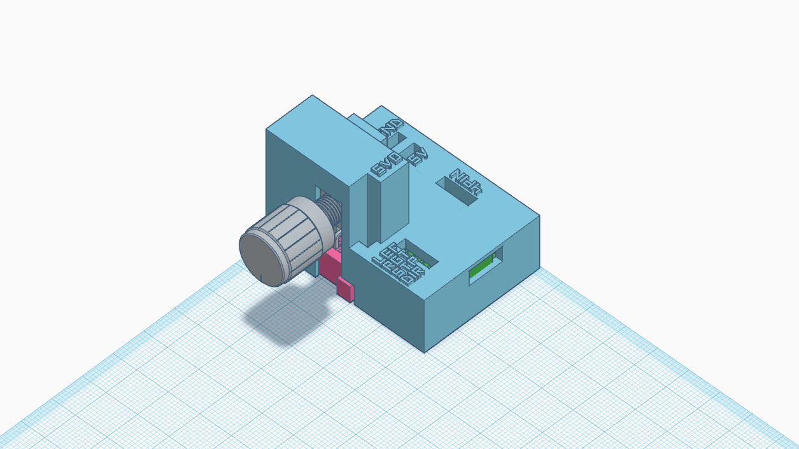
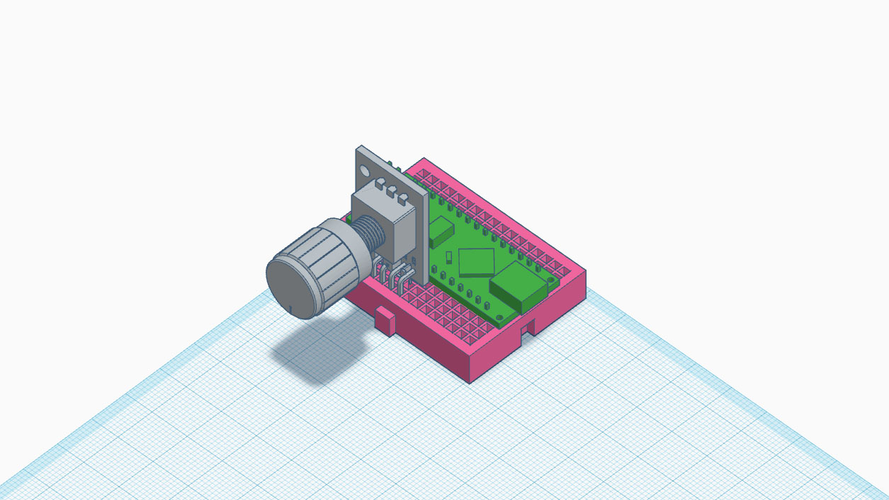
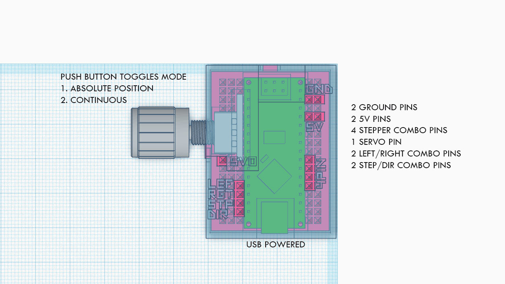

# Universal Motor Controller
A single device for testing different types of motors 
using different types of drivers.

* 2 ground pins
* 2 5V pins
* 4 stepper pins combo for drivers such as L298N and ULN2003
* 2 step/direction pins combo for drivers such as DM542T, A4988
* 1 servo pin
* 2 left/right pins combo for a driver such as BTS7960

### **Two operating modes**

Press the encoder button down to toggle the modes.

Continuous mode will blink the on board LED.

The encoder has 3 ranges. 

Centered will leave the motor on its current position.

Rotating left will rotate the motor left.

Rotating right will rotate the motor right.

There is around 10 steps/speeds available in each direction.

Toggling the mode will reset the stepper's position tracking.

### **Mode 1 - Absolute Positional**

Rotating the encoder will increment and decrement the rotation of the motor shaft by one step.

### **Mode 2 - Continuous**

Rotating the encoder will increment and decrement the rotation speed that is applied on every loop.

### **Servo**

The servo pin is not effected by the modes. 

If the servo is a continuous type, it will set its speed. 

Otherwise it will set its position.

# Parts
1. Arduino Nano with Soldered Pins - https://www.amazon.com/s?k=Arduino+nano
2. Rotary Encoder with breakout board - https://www.amazon.com/dp/B06XQTHDRR
3. Mini Breadboard - https://www.amazon.com/MCIGICM-Breadboard-Solderless-Distribution-Connecting/dp/B07Q2S9WX6
4. 3D printed case - https://www.thingiverse.com/thing:5885405

# Asssembly

**WARNING: use a micro cutter to cut the sharp tips off the back of the rotary encoder breakout board to ensure that the part will fit.**

Loosen the encoder nut until it is on the outermost edge of the threads.

Plug in the arduino nano and encoder into the breadboard according to the diagram below.
Count the pin holes and use the same orientation of the breadboard's side notches to ensure a correct fit.

Then place the 3d printed casing on top. 

It will be a incredibly tight fit.

Once in place. 

Screw the encoder nut back down until the case is unable to move.

Once assembled. Plug in the usb to your computer and upload the code.

